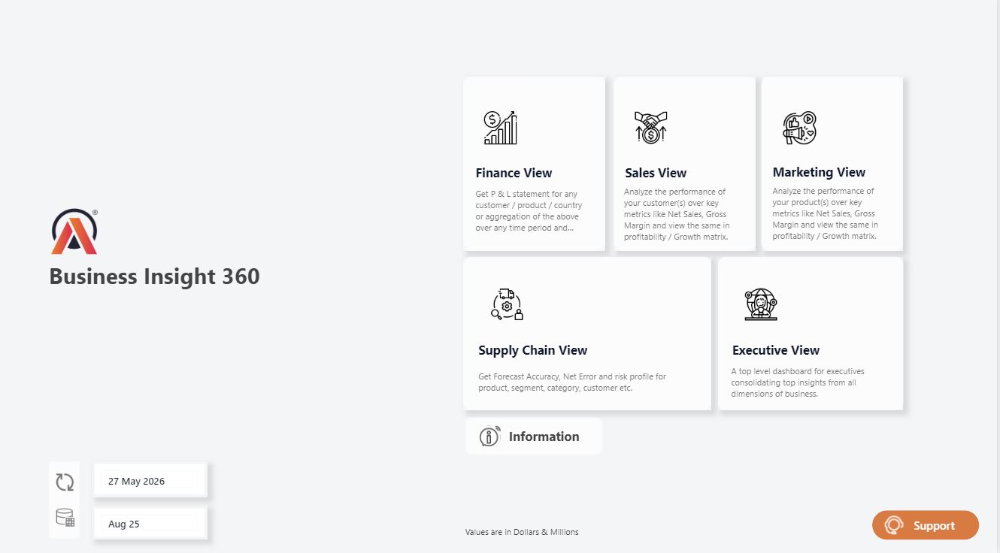
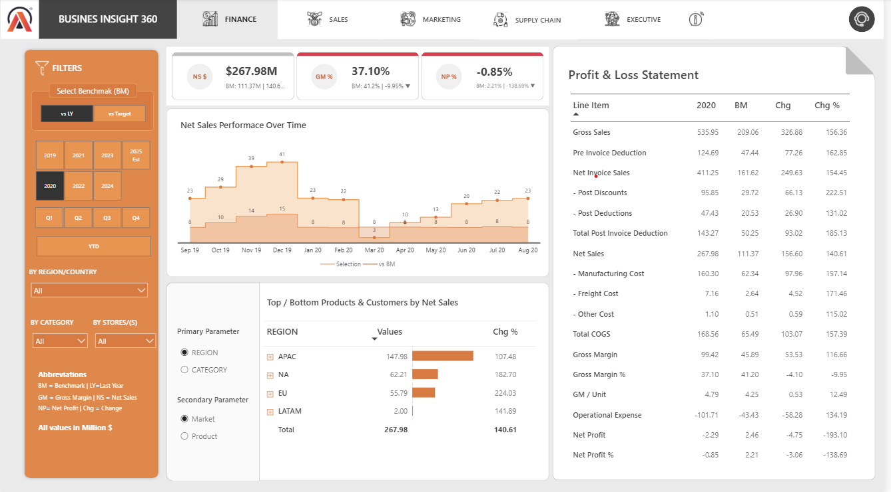
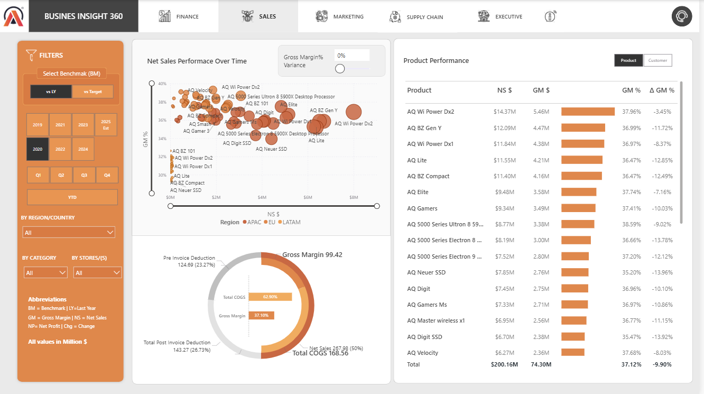
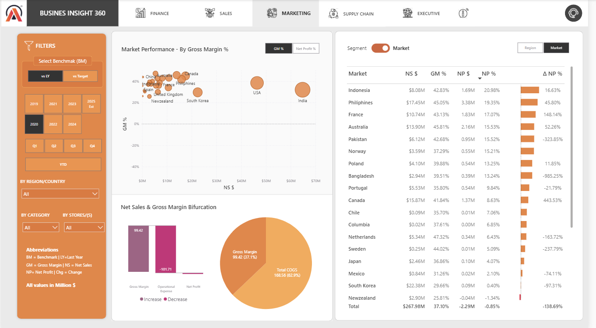
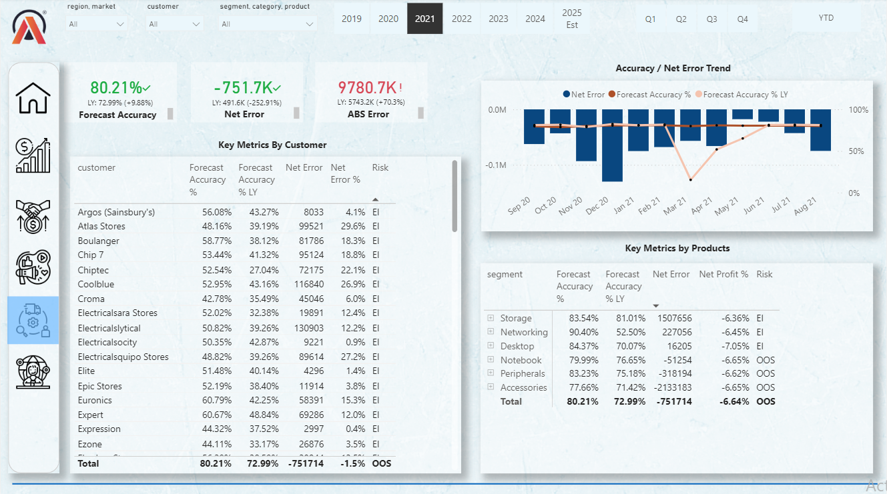
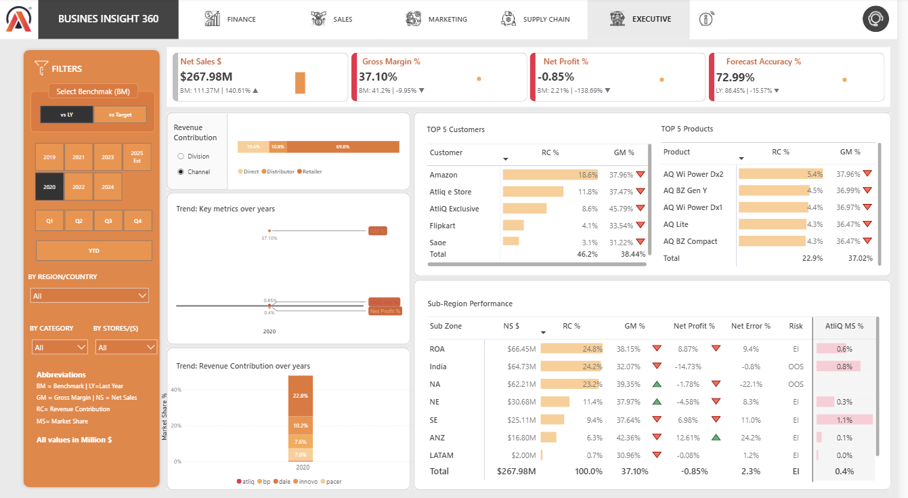

# AtliQ Hardware Enterprise Performance Matrix (Business Insights 360)

A high-performance business intelligence application designed to bridge data silos across Finance, Sales, Marketing, and Supply Chain departments, enabling automated, data-driven root cause analysis.

## 🚀 Live Interactive Dashboard
Examine the production-ready data model and active cross-filtering mechanisms via the cloud engine link below:
👉 **[Power BI Live Analytics View](https://app.powerbi.com/view?r=eyJrIjoiN2ExMTA0MjAtYmFmMS00NTVlLWE2MGYtZGRjMzNkODAzOGQxIiwidCI6ImM2ZTU0OWIzLTVmNDUtNDAzMi1hYWU5LWQ0MjQ0ZGM1YjJjNCJ9)**

---

## 🔌 Data Ingestion & Multi-Source Extraction
To mirror a real enterprise environment, the dataset was extracted from two completely different operational storage layers and merged inside Power Query:
1. **Relational Database (SQL):** All core transactional sales records and customer profiles were imported directly from a live **MySQL database** to ensure high-fidelity transactional tracking.
2. **Flat Files (Excel/CSV):** Supplemental corporate planning data—including regional targets, operational expense matrices, and market share spreadsheets—were extracted from static **Excel workbooks** to blend actual performance against management goals.

---

## 📊 Core Business Problems & Analytical Solutions

### 1. Landing Hub & Executive Control Center
* **The Problem:** Executives lacked a single starting portal to navigate separate department metrics, leading to fragmented communication across different regional business units.
* **The Solution:** Engineered a centralized interactive portal that allows cross-functional stakeholders to jump into localized workflows instantly while tracking system update timelines.



---

### 2. Finance View: Diagnosing Margin Erosion
* **The Problem:** In fiscal year 2022, AtliQ Hardware recorded an aggressive $300\%+$ increase in global Net Sales, yet consolidated Net Profit percentages unexpectedly fell into severe negative margins ($-13.65\%$). Excel-based regional reporting could not isolate where the revenue leaks were occurring.
* **The Solution:** Engineered a dynamic, hierarchical **Profit & Loss (P&L) Statement** with nested drill-downs (Region > Country > Customer). 
* **Key Analytical Feature:** Built dynamic cost allocation metrics that isolated the "OPEX Trap." The analysis proved that while sales volume spiked, regional operational expenses (OPEX) and freight costs scaled disproportionately, eroding gross profit gains before reaching the net layer.



---

### 3. Sales View: Overcoming Customer Concentration & Discounting Risks
* **The Problem:** Sales teams were heavily incentivizing high-volume retail buyers with aggressive promotional discounts to meet gross revenue quotas, blind to the true cost-to-serve and account profitability.
* **The Solution:** Implemented an interactive **Profitability vs. Growth Matrix (Scatter Plot)** paired with custom hidden **Hover Tooltips**.
* **Key Analytical Feature:** Hovering over any specific retailer instantly populates an independent historical performance card showing that account's specific *Net Sales Trend* vs. *Gross Margin %*. This enables accounts managers to immediately detect customer accounts that have high gross revenue but yield near-zero or negative margins due to excessive promotional pricing.



---

### 4. Marketing & Product View: Strategic SKU Optimization
* **The Problem:** Product managers lacked visibility into product lifecycle health and could not efficiently determine which inventory SKUs deserved major marketing budget allocations.
* **The Solution:** Built a product segmentation engine tracking product performance against historical benchmarks.
* **Key Analytical Feature (Dynamic Axis Parameter Switch):** Implemented an advanced DAX-driven parameter toggle. Users can swap the primary visual axes instantly between *Net Profit %* and *Gross Margin %* with a single slicer click. This allows marketing teams to evaluate product categories by raw operational efficiency or final bottom-line profitability without introducing redundant visuals.



---

### 5. Supply Chain View: Minimizing Stockouts & Overstock Hazards
* **The Problem:** Disconnected warehousing and sales data led to severe inventory stockouts on high-demand items (causing customer dissatisfaction) and expensive overstocking on lagging lines.
* **The Solution:** Formulated a predictive inventory optimization matrix.
* **Key Analytical Feature:** Programmed advanced calculated measures to compare **Forecast Accuracy %** directly against **Net Error** and **Absolute Error** indicators. By establishing clear thresholds, the view automatically flags product groups as "High-Risk Stockouts" or "Surplus Inventory," allowing supply chain managers to adjust fulfillment pipelines before fulfillment failures hit retail partners.



---

### 6. C-Suite Executive Briefing View
* **The Problem:** Top leadership required a summarized view of all operational areas simultaneously without digging through individual departmental sub-reports.
* **The Solution:** Aggregated mission-critical KPIs from all four functional areas onto a single screen to give executives an immediate health check of global operations.



---

## 🛠️ Data Engineering & Architecture Summary
* **Data Modeling:** Robust Star-Schema architecture separating transactional facts (Sales, Forecasts) from localized dimensions (Customer, Product, Geography).
* **Advanced DAX & ETL:** Utilized Power Query (M Language) for structural data cleaning, fact table normalization, and schema alignment. Complex analytical metrics were constructed using explicit DAX behaviors, context manipulation (`CALCULATE`), and time-intelligence expressions.
* **Data Refresh Scale:** Consolidated disparate enterprise spreadsheets (`marketshare-v2025.xlsx`, `operating-expenses-table.xlsx`, `targets.xlsx`) with historic ingestion tracks extending up to August 2025.

---

## 💡 Local Development Setup
1. Clone this repository directly to your workspace:
   ```bash
   git clone [https://github.com/Pareekpriya/Bussiness_Insight360_PowerBI.git](https://github.com/Pareekpriya/Bussiness_Insight360_PowerBI.git)
