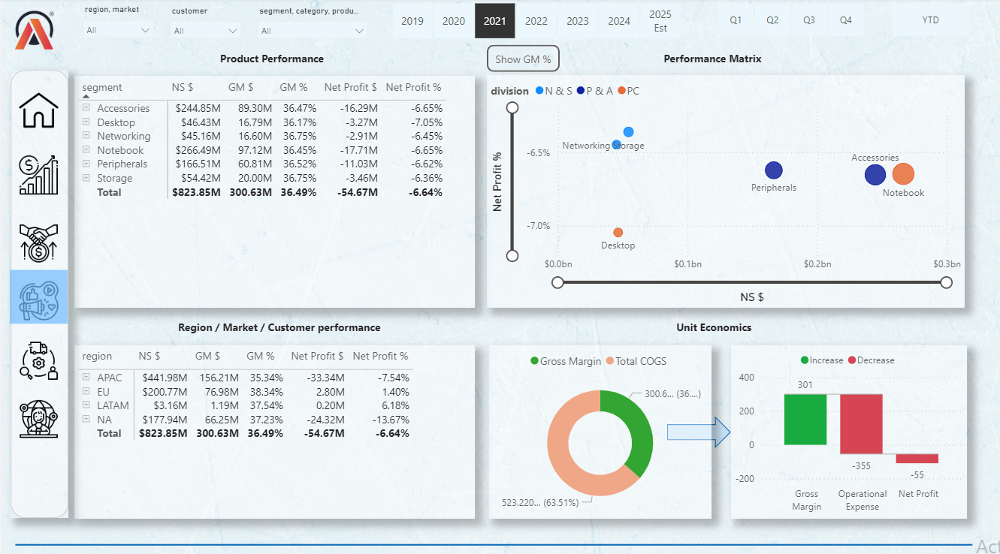

# Business Insights 360 — Atliq Hardware

An interactive, enterprise-grade Power BI 360° business intelligence dashboard designed to track, analyze, and optimize Atliq Hardware’s global operations across multiple business dimensions.

## 🚀 Live Interactive Dashboard
You can interact with the fully functional, live dashboard directly below:

[Power BI Live View Link](https://app.powerbi.com/view?r=eyJrIjoiN2ExMTA0MjAtYmFmMS00NTVlLWE2MGYtZGRjMzNkODAzOGQxIiwidCI6ImM2ZTU0OWIzLTVmNDUtNDAzMi1hYWU5LWQ0MjQ0ZGM1YjJjNCJ9)

---

## 📊 Project Overview & Core Views
This project consolidates data from Finance, Sales, Marketing, and Supply Chain departments into a unified BI tool, eliminating data silos and empowering executives to make data-driven decisions.

Values across the report are scaled in **Dollars ($) & Millions** for clean executive reporting.

### 1. 🏠 Home Page
The central navigation hub of the tool. Designed with an intuitive UX/UI that allows users to seamlessly jump into any dedicated functional view, access the user manual, or connect with a support specialist.

 

### 2. 💰 Finance View
* **Objective:** Evaluation of financial performance, profitability, and P&L trends.
* **Key Metrics & Tools:** * Full dynamic **Profit & Loss (P&L) Statement** breakable by Customer, Product, Country, or custom time periods.
  * Deep-dives into Net Sales, Gross Margin, and Operational Expenses (OPEX).

   

### 3. 📈 Sales View
* **Objective:** Analyze customer behavior and performance across key business indicators.
* **Key Metrics & Tools:** * Evaluation of Net Sales and Gross Margin percentage ($GM\%$).
  * Comprehensive **Profitability / Growth Matrix** to isolate high-performing customer segments from risk zones.
  * **💡 Advanced Feature (Hover Tooltip):** Hovering over any **Customer Name** triggers a dynamic, pop-up report page showing historical trends for **Net Sales (NS)** and **Gross Margin % (GM%)** specifically for that customer.
    
  
  
  

### 4. 🎯 Marketing View
* **Objective:** Double-down on product segment performance and marketing ROI.
* **Key Metrics & Tools:**
  * Performance breakdown across product categories and individual SKUs.
  * Product-level **Profitability / Growth Matrix** to guide inventory prioritization and promotional budgets.
  * **💡 Advanced Feature (Dynamic Plot Toggle):** Features a custom parameter switch allowing users to instantly change the scatter plot's Y-axis metrics between **Net Profit %** and **GM%** for flexible strategic analysis.

  

### 5. 🚚 Supply Chain View
* **Objective:** Maximize fulfillment efficacy and evaluate operational risk profile.
* **Key Metrics & Tools:**
  * **Forecast Accuracy** tracking vs. Actual Net Error metrics.
  * Supply risk classification profiles broken down by product segment, category, and target customer groups.

   
### 6. 👑 Executive View
* **Objective:** A strategic, high-level overview tailored for C-suite decision-makers.
* **Key Metrics & Tools:**
  * Consolidates top insights from all dimensions of the business (Finance, Sales, Marketing, Supply Chain).
  * High-impact KPI cards displaying holistic business health indicators at a glance.

  

## 🛠️ Data Architecture & Tech Stack
* **BI Tool:** Power BI Desktop / Power BI Service
* **Data Refresh Scale:** Up-to-date data ingestion tracking up to August 2025.
* **Data Sources Utilized:** Market share metrics (`marketshare-v2025.xlsx`), Operational budgets (`operating-expenses-table.xlsx`), and strategic corporate targets (`targets.xlsx`).

---

## 💡 How to Run This Project Locally
1. Clone this repository to your machine.
2. Download and install [Power BI Desktop](https://powerbi.microsoft.com/).
3. Open the `.pbix` file.
